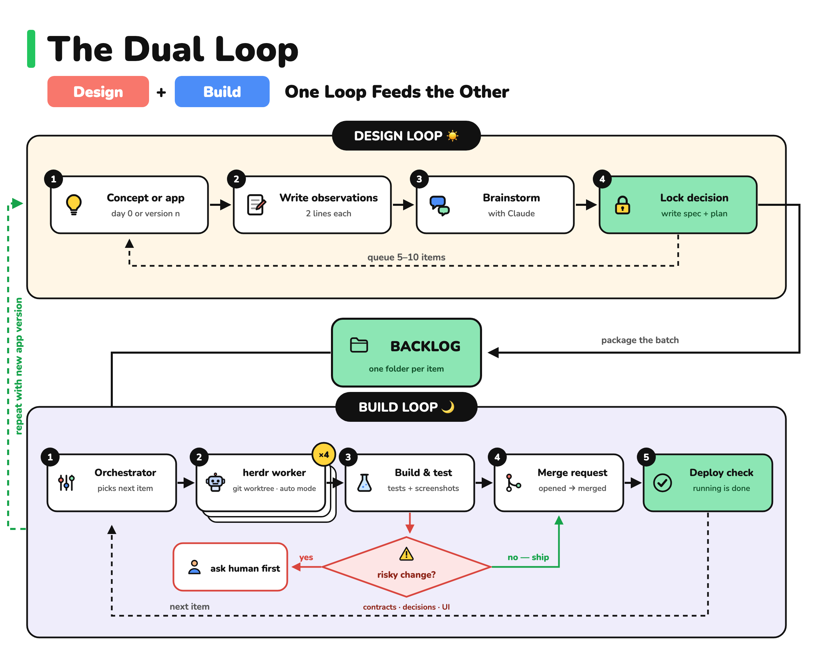
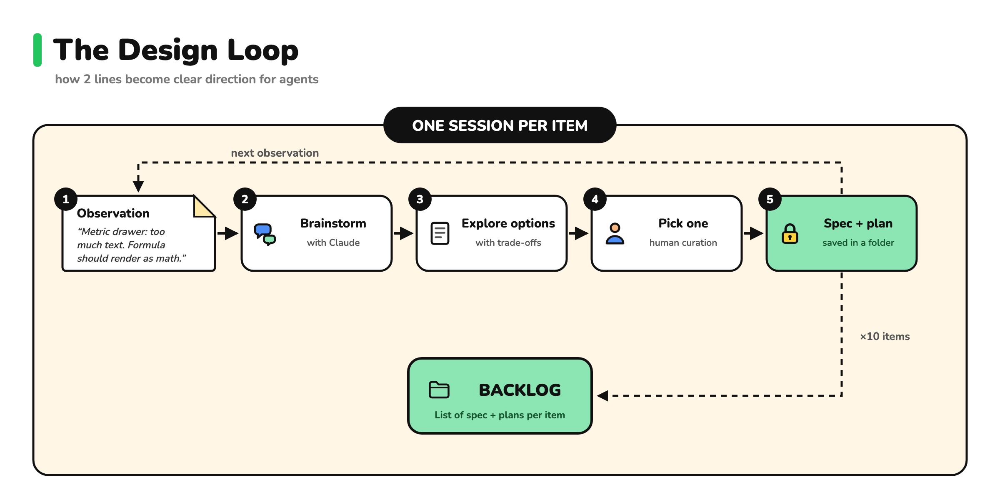
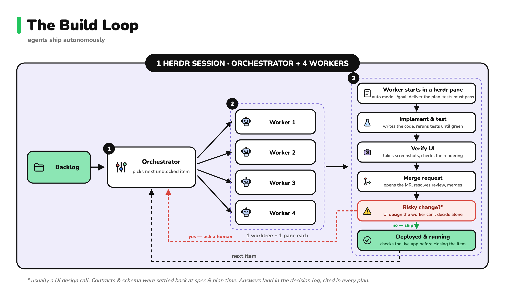

<p align="center">
  <picture>
    <source media="(prefers-color-scheme: dark)" srcset=".github/assets/logo.png">
    
  </picture>
</p>

# Dual Loop Harness

**Humans decide what to build. Agents build it.**

Steve Yegge, in [The Shape of Things to Come](https://yegge.ai/essays/the-shape-of-things-to-come/) (August 2026), predicts that "harnesses will all soon be bespoke", because a harness meets the specific needs of whoever builds it. I built my own and I agree. The basic components are the same for everyone: "You need Claude accounts, Beads, a brain folder for your Markdown files, and coding agents. Pretty much nothing else." 

The dual loop is a portable harness that builds full-stack apps with autonomous agents: install it as a plugin, and your state stays in your repo. It's composed of:

- **Coding agents:** Claude Code sessions. 1 design session, 1 orchestrator, up to 4+ workers in auto mode, each in its own git worktree.
- **Runtime:** [herdr](https://github.com/herdrdev/herdr). The orchestrator and every worker live in 1 herdr session: the lanes are tabs you can open, read, and answer.
- **Queue:** [beads](https://github.com/steveyegge/beads) (`bd`). Status and dependencies that survive compaction and session death.
- **Brain folder:** `dual-loop-brain/`. Observations, specs and plans, the decision log, worker reports, handoffs.
- **Guardrails:** rules injected at every session start, a Stop hook, auto mode plus a deny list for workers, and `contracts/` for the interfaces parallel lanes share.

## How it works

A harness is the fixed structure around your coding agents: memory, work queue, guardrails, prompts. The model supplies capability. The harness turns it into shipped software. This one is 2 loops, 1 contract between them, and 4 principles underneath.

**2 loops.**

1. **The design loop is human-led.** You write 2-line observations. A session interviews you, proposes options, locks a decision, and writes a build-ready spec and plan.
2. **The build loop is autonomous.** An orchestrator dispatches workers, verifies their work empirically, opens and merges PRs, and hands you a run review.

**1 contract.** The loops meet at the backlog: 1 folder per item, with `spec.md` (what), `plan.md` (how), and 1 bead. Humans work upstream, agents downstream, and this folder is the only handoff between them. It is the design loop's product and the build loop's only input.

**4 architecture principles.**

- **Plain files.** Markdown, git, and beads. No database, and no service owns state: herdr only hosts the terminals. Every rule, decision, plan, and report is a file you can read in a minute and diff in a PR.
- **Code and state stay apart.** Harness code (commands, rules, hooks, templates) lives in the plugin and upgrades as 1 unit. Harness state (your backlog, decisions, reports) lives in your repo and is never overwritten. Every rule has exactly 1 home and loads when its role's session starts.
- **Verified or it didn't happen.** A verify gate and alert rules stand between a worker and `main`. Tests, empirical proof, and a fresh-eyes spec review come before the PR. Merge is not done.
- **Restartable.** Beads, reports, and handoffs survive compaction and session death. Any session can be killed, and a successor resumes from files.

The harness was extracted from a real build. The story of its first run: [Design by Day, Build by Night](https://curiosityisallyouneed.substack.com/p/design-by-day-build-by-night-shipping) (August 2026). I have since used it at work to build internal apps fast, and for my side-project experiments. The design also draws on HumanLayer's writing on agent design. Star this repo to follow its development.



## Install

```bash
# once per machine
claude plugin marketplace add uzampogn/dual-loop-harness
claude plugin install dual-loop@dual-loop-harness

# in your app repo, new or existing
cd my-app && claude
> /dual-loop:adopt-harness
```

Adoption does 5 things and leaves the rest of your repo alone:

- Scaffolds `dual-loop-brain/` and `contracts/`.
- Writes or merges `.claude/settings.json`: plugin enablement, auto mode as the default permission mode, and the workers' allow and deny lists.
- Appends a short `## Dual-loop harness` section to your `CLAUDE.md`. Your prose stays yours.
- Runs `bd init` and cleans up after it.
- Asks for your 3 most-settled decisions (stack, deploy target, visual direction) and seeds the decision log with them.

Upgrade later with `claude plugin update dual-loop`. The plugin owns no file in your repo, so an upgrade never touches your state.

Prerequisites:

- Required: [Claude Code](https://claude.com/claude-code), [herdr](https://github.com/herdrdev/herdr), `git`, `bd`, `jq`, and `gh` or `glab`. herdr is the build loop's runtime: the orchestrator dispatches workers into herdr panes and waits on their state. The design loop runs anywhere.
- Optional: [Superpowers](https://github.com/obra/superpowers) for design-loop depth. Enable it in the gitignored `.claude/settings.local.json`, not the repo settings, so workers stay bare.
- Optional: [Playwright](https://github.com/microsoft/playwright-mcp) for screenshot evidence. The scaffolded settings enable it. Add `anthropics/claude-plugins-official` first, or drop the entry.

Start every session with `cd <your-app-repo>`. The repo's `.claude/settings.json` enables the plugin, so a session launched from a parent folder won't load it. Accept the trust dialog once, in an interactive session at the repo root: until you do, Claude Code ignores the repo's allow list. Worker worktrees inherit that trust. Start the build loop inside herdr: `herdr`, then `claude` in a pane, then `/dual-loop:build-session`.

## Commands

| Command | Who runs it | What it does |
|---|---|---|
| `/dual-loop:adopt-harness` | you, once | Scaffold the harness into the current repo. |
| `/dual-loop:create-observations` | you | Open today's observations file. Jot O/C pairs: what you saw, why it matters. |
| `/dual-loop:design-session` | you + Claude | 1 observation, an interview, a locked decision, then `spec.md`, `plan.md`, and 1 bead. |
| `/dual-loop:build-session` | the orchestrator | Drain `bd ready`: dispatch workers, verify, PR, review comments, merge, deploy check, run review. |
| `/dual-loop:check-build-status` | anyone | Where the build stands. Read-only. |
| `/dual-loop:write-handoff` | any closing session | The handoff note per the contract: the orchestrator's run review, or a design note when a session is interrupted. |

Rules load by the mechanism that triggers each role:

- Guardrails and worker rules: every session start, through a hook. Workers have no command file, so this is the only guaranteed delivery. A casual `claude` in the repo is still bound by "never commit to main".
- Orchestrator rules: inside `/dual-loop:build-session`.
- Design rules: inside `/dual-loop:design-session`.

## The design loop: observations in, backlog items out



- Run `/dual-loop:create-observations` and feed short feedback to today's dated file, 2 unpolished lines per item.
- Day 0, no app yet? The pitch is the observation. Write O0, your 2-line app idea, and the first session turns it into the opening items: a walking skeleton and frozen contracts.
- With 5 to 10 observations in hand, run 1 `/dual-loop:design-session` per item. Claude checks how the app works today, interviews you like a pairing partner in plain Q&A (`AskUserQuestion` is denied on purpose), and proposes 2 or 3 options. You pick one.
- The session ends with a build-ready `dual-loop-brain/02-backlog/<item>/`, 1 bead, and the exact command to start the build loop.

## The build loop: 1 orchestrator, up to 4 parallel workers



`/dual-loop:build-session` reports where the build stands, then drains the backlog. Per item:

- A worker in its own git worktree and herdr pane, auto mode on, with 1 plan and 1 file boundary. The orchestrator starts it with `herdr agent start`, hands it the plan through `herdr agent prompt --wait`, and that wait returning is the loop tick.
- A verify gate before any PR: tests, empirical proof, a file-boundary check, and a fresh-eyes spec review.
- A PR, the review-comment loop, merge, deploy check, `bd close`.

Every lane is a tab in your herdr session. `herdr agent list` is the lane board, and a lane that shows `blocked` is a pane you can open and answer. Auto mode's classifier approves routine work and refuses destructive actions, and the deny list in `.claude/settings.json` still binds.

The orchestrator never writes code. Fixes and checks go to background agents, and it keeps lanes saturated whenever file boundaries allow. Every run ends with a run review in `dual-loop-brain/04-handoffs/`: what shipped, the evidence, and what needs your decision. Reviewing a night's work takes minutes.

2 guardrails run by default, the alert rules in the decision log. Changes to `contracts/` or the data schema, and UI changes, are built in full but wait for your review before merging. Everything else ships without you. The playbook (topology, model and effort rubric, coordination rules, recovery) is [`references/build-strategy.md`](references/build-strategy.md).

## What lands in your repo

```
your-app/
├── CLAUDE.md                  # yours, plus an appended "## Dual-loop harness" section
├── .claude/settings.json      # enabledPlugins: dual-loop · auto mode · allow + deny lists · AskUserQuestion deny
├── dual-loop-brain/           # state only. The plugin owns no file here
│   ├── 00-decision-log.md     # settled decisions + precedence + alert rules
│   ├── 01-observations/       # dated observation files
│   ├── 02-backlog/            # BACKLOG.md (generated from beads) + 1 folder per item (spec + plan)
│   ├── 03-build-reports/      # workers report here: evidence, blockers
│   └── 04-handoffs/           # session handoffs. The orchestrator's note is the run review
└── contracts/                 # frozen interfaces between parallel lanes
```

| Question | Look at |
|---|---|
| What's next? | `bd ready` · `dual-loop-brain/02-backlog/BACKLOG.md` (generated view: read it, never edit it) |
| What did the run ship, what needs me? | newest `dual-loop-brain/04-handoffs/*-orchestrator.md` |
| What happened, in detail? | `dual-loop-brain/03-build-reports/<item>/` · `git log` · `/dual-loop:check-build-status` |
| Why is it this way? | `dual-loop-brain/00-decision-log.md` |

## Where the human is needed

Curation. Deciding what to build and for whom, picking 1 option when the brainstorm surfaces 3, judging the UX and UI, and reviewing the merges the alert rules flag. The more specific your product vision, the better your chance of building something useful. A vague vision produces good-looking software nobody needs, faster than ever.

Variations:

- Solo feature work: skip the orchestrator. Run `/dual-loop:design-session`, then launch 1 worker yourself with Claude Code's built-in `/goal`.
- Small models: auto mode is unavailable on Haiku 4.5, and the session silently falls back to manual mode. Workers run on Sonnet 5 and up.
- GitLab: swap `gh pr` for `glab mr` in the playbook and the allowlist.
- No deployment yet: the deploy check degrades to a local run.

## Features

**Design loop**

- Observations in, a build-ready item out: `spec.md`, a `plan.md` with model, effort, file boundary and TDD steps, and 1 bead.
- Plain Q&A interview, 2 or 3 options with trade-offs, 1 locked decision with its rationale in the decision log.
- Uses Superpowers brainstorming and writing-plans when installed. Runs the same shape inline otherwise.

**Build loop**

- Up to 4 lanes, each a git worktree and a herdr pane, refilled only with items whose file boundaries are disjoint.
- Workers run in auto mode with the model and effort the playbook's rubric picks. `herdr agent prompt --wait` returning is the loop tick.
- Verify gate before any PR: tests, empirical proof, file-boundary check, fresh-eyes spec review. Then PR, review-comment loop, merge, deploy check, `bd close`.
- The orchestrator never writes app code. Human-bound items are parked with a 1-line reason.

**Memory**

- Decision log with precedence rules and a status legend: Locked, Proposed, Open, Superseded.
- Beads is the queue's source of truth. Build reports carry evidence beside every claim. Handoffs follow a fixed contract.
- `contracts/` freezes the interfaces parallel lanes share. Only the orchestrator edits it, and a change is a version bump.

**Guardrails**

- A SessionStart hook injects the rules into every session, worktrees included. A Stop hook blocks ending with in-progress beads no lane claims.
- 3 alert rules hold `contracts/`, schema, and UI changes for your review. Deny list: `sudo`, `rm -rf /`, force push, `AskUserQuestion`.
- Workers: TDD per step, never commit to `main`, never edit `contracts/` or the decision log.

**Adoption**

- 1 command scaffolds everything and seeds your first 3 decisions. The plugin owns no file in your repo, so updates never touch your state.
- GitHub or GitLab. No deployment yet? The deploy check degrades to a local run.

## Developing the plugin

This repo is the plugin:

- `commands/`, `skills/`, `hooks/` (SessionStart rules injection and the Stop hook), `rules/`, `references/`.
- `templates/`: lands verbatim in user repos. Never put a plugin-internal path there.
- `.claude-plugin/`: manifest and marketplace.
- A rule has exactly 1 home. The delivery map is in [`docs/architecture.md`](docs/architecture.md). Keep it and this README current.

The repo is its own marketplace, so the test loop is local:

```bash
claude plugin marketplace add "$(pwd)" && claude plugin install dual-loop@dual-loop-harness
mkdir toy-app && cd toy-app && git init && git commit --allow-empty -m init
claude                                   # interactive: adoption prompts for the template read and the .claude/ write
> /dual-loop:adopt-harness
git worktree add ../toy-wt -b lane1 && cd ../toy-wt
claude -p --model claude-haiku-4-5-20251001 "Is the heading 'Dual-loop guardrails (every session)' in your context? Reply INJECTED or MISSING."
# expected: INJECTED. The SessionStart hook reached a session in a linked worktree
claude plugin uninstall dual-loop && claude plugin marketplace remove dual-loop-harness
```

The install is a cache snapshot, and `claude plugin update` is a no-op at an unchanged version. After a change, bump `version` in `.claude-plugin/plugin.json`, or run `marketplace update`, uninstall, and reinstall.

## License

MIT. Steal the setup.
